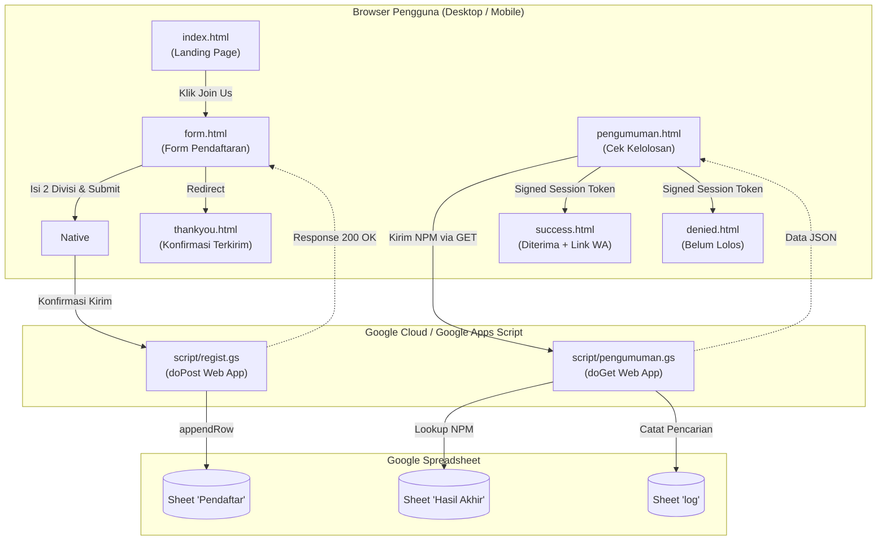

# 📘 DOKUMENTASI TEKNIS & PANDUAN HANDOVER PENGURUS
## Sistem Open Recruitment PROTIC (Politeknik Negeri Cilacap)

Dokumen ini ditujukan bagi **Divisi Web / Kominfo / Pengurus PROTIC** saat ini maupun **pengurus periode berikutnya** untuk memahami arsitektur, pemeliharaan, alur data, integrasi backend, aspek keamanan, dan tata cara serah terima (*handover*) sistem website Open Recruitment PROTIC.

---

## 📑 Daftar Isi
1. [Arsitektur Sistem & Alur Data](#1-arsitektur-sistem--alur-data)
2. [Frontend & Build Pipeline (Tailwind CSS v3)](#2-frontend--build-pipeline-tailwind-css-v3)
3. [Integrasi Backend Google Apps Script (GAS)](#3-integrasi-backend-google-apps-script-gas)
4. [Mekanisme Keamanan (Hardening Session Storage)](#4-mekanisme-keamanan-hardening-session-storage)
5. [Checklist Handover untuk Periode Baru](#5-checklist-handover-untuk-periode-baru)
6. [Panduan Tambah, Ubah, atau Hapus Divisi](#6-panduan-tambah-ubah-atau-hapus-divisi)
7. [Panduan Deployment ke Server Politeknik](#7-panduan-deployment-ke-server-politeknik)
8. [Panduan Troubleshooting & Masalah Umum](#8-panduan-troubleshooting--masalah-umum)

---

## 1. Arsitektur Sistem & Alur Data

Sistem ini dirancang dengan konsep **Jamstack / Static Site dengan Serverless Backend**:



### Keuntungan Arsitektur Ini:
1. **Biaya Rp 0 (Gratis)**: Tidak membutuhkan database berbayar seperti MySQL/PostgreSQL; data tersimpan langsung di Google Sheets milik akun organisasi.
2. **Kinerja Tinggi**: Seluruh frontend berstatus file statis murni sehingga dapat disajikan dengan kecepatan kilat oleh server kampus.
3. **Mudah Diaudit**: Panitia oprec non-teknis (Humas/Sekretaris) bisa memantau data pendaftar secara langsung (*realtime*) di Google Spreadsheet.

---

## 2. Frontend & Build Pipeline (Tailwind CSS v3)

### 2.1 Tooling
- **CSS Framework**: Tailwind CSS v3 lokal (via `package.json` dan `devDependencies`).
- **Source CSS**: [src/input.css](src/input.css).
- **Output CSS**: [dist/output.css](dist/output.css) (terminifikasi menjadi ~32 KB, dipakai oleh seluruh 6 halaman).
- **Design Configuration**: [tailwind.config.js](tailwind.config.js).

### 2.2 Token Desain PROTIC (Design Tokens)
Seluruh warna dan gaya khas PROTIC telah dibakukan dalam `tailwind.config.js`:
- `primary`: `#3BAE6D` (Hijau Utama PROTIC)
- `lightgreen`: `#49D185` (Hijau Terang Aksen)
- `lightergreen`: `#87EBB3` (Hijau Muda Highlight)
- `accentgreen`: `#80C89F` (Hijau Border Glow)
- `darkgreen`: `#06291E` (Hijau Gelap Kontainer)
- `meddarkgreen`: `#114B2A` (Hijau Gradasi Form)
- `bgdark`: `#161616` (Background Gelap Utama)
- `surface`: `#0d1a13` (Background Modal & Dialog)
- Font: `Cinzel` (Headings) dan `Poppins` (Body text)

### 2.3 Perintah Kompilasi CSS
Setiap kali Anda menambahkan kelas Tailwind baru di file HTML:
```bash
# Untuk kompilasi otomatis saat sedang coding:
npm run watch:css

# Untuk kompilasi final produksi (minified):
npm run build:css
```

> ⚠️ **Catatan Penting**: Jangan pernah mengedit [dist/output.css](dist/output.css) secara langsung karena file tersebut otomatis ditimpa (*overwritten*) setiap kali kompilasi berjalan. Tulis custom rule di [src/input.css](src/input.css).

---

## 3. Integrasi Backend Google Apps Script (GAS)

Backend sistem ini terletak di direktori [script/](script/) dan terdiri dari dua file script Google Apps Script:

### 3.1 Pendaftaran & Manajemen Pendaftar (`script/regist.gs`)
Menerima payload HTTP POST berformat JSON dari [form.html](form.html) untuk mengelola data di sheet bernama **`Pendaftar`**.

Script ini mendukung 4 aksi operasi (*Action Contract*):
1. **`action: "register"`** (Pendaftaran Baru):
   * Memeriksa apakah NPM sudah terdaftar di Kolom C.
   * Jika sudah ada, mengembalikan `{ result: "duplicate", message: "NPM sudah terdaftar..." }`.
   * Jika belum ada, menambahkan baris baru dengan `sheet.appendRow(...)`.
2. **`action: "verify"`** (Verifikasi Identitas & Ambil Data):
   * Menerima parameter `npm` dan `pin` (4 digit terakhir nomor WhatsApp pendaftar).
   * Memvalidasi kecocokan data. Jika valid, mengembalikan data lengkap pendaftar `{ result: "success", data: { ... } }`.
3. **`action: "update"`** (Pembaruan Data):
   * Menerima parameter `npm`, `pin`, dan kolom yang diperbarui.
   * Memvalidasi otorisasi via PIN WhatsApp.
   * Menimpa (*overwrite*) baris yang bersangkutan di sheet `Pendaftar` dengan data terbaru dan memperbarui timestamp.
4. **`action: "delete"`** (Pembatalan / Hard Delete):
   * Menerima parameter `npm` dan `pin`.
   * Menghapus baris secara permanen dari Google Sheets menggunakan `sheet.deleteRow(rowIndex)`.

**Skema Kolom di Sheet `Pendaftar`**:
| Kolom | Nama Field | Keterangan |
|---|---|---|
| A | Timestamp | Waktu pendaftaran / pembaruan otomatis (`new Date()`) |
| B | Nama Lengkap | String nama pendaftar (`data.fullname`) |
| C | NPM / NIM | Nomor Pokok Mahasiswa (`data.npm`) |
| D | Kelas | Contoh: `TI-2A` (`data.class`) |
| E | Semester | Integer 1–8 (`data.semester`) |
| F | Divisi Pilihan 1 | Contoh: `WEB` (`data.division1`) |
| G | Divisi Pilihan 2 | Contoh: `UI/UX` (`data.division2`) |
| H | Portofolio / CV | Link URL Google Drive (`data.portfolio`) |
| I | Nomor WhatsApp | Format angka (`data.whatsapp`) |
| J | Email Aktif | Alamat email pendaftar (`data.email`) |

### 3.2 Pengumuman (`script/pengumuman.gs`)
Menerima request HTTP GET dengan parameter `?npm=230102001` dari [pengumuman.html](pengumuman.html), mencari baris data di sheet **`Hasil Akhir`**, dan mencatat riwayat pencarian ke sheet **`log`**.

**Skema Kolom di Sheet `Hasil Akhir`**:
| Kolom | Header | Keterangan |
|---|---|---|
| A | NPM | NPM Mahasiswa (wajib format teks agar angka `0` di depan tidak hilang) |
| B | Nama | Nama lengkap mahasiswa |
| C | Divisi | Divisi tempat mahasiswa diterima (misal: `WEB`, `UI/UX`, dst.) |
| D | Status | Nilai wajib: `Diterima` atau `Tidak Lolos` / `Belum Lolos` |

**Skema Kolom di Sheet `log`**:
| Kolom | Header | Keterangan |
|---|---|---|
| A | Timestamp | Waktu pencarian dilakukan |
| B | NPM | NPM yang dicari |
| C | Nama | Nama yang ditemukan (atau `-`) |
| D | Status | Status kelolosan (atau `-`) |
| E | Divisi | Divisi diterima (atau `-`) |
| F | Ditemukan | `Ya` atau `Tidak` |

---

## 4. Mekanisme Keamanan (Hardening Session Storage)

Sebelum optimasi Fase 7 (`U-20`), halaman [success.html](success.html) hanya membaca data dari `sessionStorage` polos. Ini membuka celah keamanan di mana pengguna bisa mengetikkan `sessionStorage.setItem('studentData', ...)` di console browser dan mendapatkan nomor kontak WhatsApp koordinator internal.

### 4.1 Solusi Pengamanan Token Terintegrasi
Sistem saat ini menerapkan **Dual-Round Hash Checksum + Time-To-Live (TTL)**:

```javascript
// Algoritma pembangkit token di pengumuman.html, success.html, dan denied.html:
function generateSecurityToken(npm, status, timestamp) {
  const secretSalt = "PROTIC_OPREC_2026_SECURITY_SALT_v1";
  const payload = String(npm).trim() + "|" + String(status).toLowerCase().trim() + "|" + timestamp + "|" + secretSalt;
  let hash = 5381;
  for (let i = 0; i < payload.length; i++) {
    hash = ((hash << 5) + hash) + payload.charCodeAt(i);
    hash = hash & hash;
  }
  let hash2 = 0x811c9dc5;
  for (let i = 0; i < payload.length; i++) {
    hash2 ^= payload.charCodeAt(i);
    hash2 = Math.imul(hash2, 0x01000193);
  }
  return ((hash >>> 0).toString(16).padStart(8, "0") + (hash2 >>> 0).toString(16).padStart(8, "0"));
}
```

### 4.2 Aturan Validasi di `success.html`:
1. **Integritas Token**: Token yang dikirim harus cocok persis dengan kalkulasi ulang hash dari `NPM + Status + Timestamp + Salt`. Jika ada yang mengubah `Status` dari `tidak lolos` menjadi `diterima`, token otomatis tidak valid.
2. **Batas Waktu Kedaluwarsa (TTL)**: Sesi hanya berlaku maksimal **15 menit** (`MAX_SESSION_AGE = 15 * 60 * 1000`). Jika sesi lebih lama dari 15 menit, data langsung dihapus dari browser.
3. **Pengecekan Status Diterima**: Nilai `data.Status` wajib bernilai `"diterima"`.
4. **Proteksi Kontak**: Jika salah satu validasi gagal, halaman **TIDAK AKAN** menampilkan nomor WhatsApp ataupun link grup koordinator divisi dan mengunci tampilan ke mode fallback.

---

## 5. Checklist Handover untuk Periode Baru

Saat pergantian kepengurusan ke periode baru (misal dari periode 2026/2027 ke 2027/2028), ikuti 5 langkah checklist berikut:

### ✅ Langkah 1: Perbarui Teks Tahun Periode
Cari dan ganti seluruh teks `2026/2027` dan tahun copyright `© 2026` di semua file:
- [index.html](index.html)
- [form.html](form.html)
- [pengumuman.html](pengumuman.html)
- [success.html](success.html)
- [denied.html](denied.html)
- [thankyou.html](thankyou.html)

### ✅ Langkah 2: Siapkan Google Spreadsheet Baru
1. Buat Google Spreadsheet baru di Google Drive resmi PROTIC (misal: `Oprec PROTIC 2027-2028`).
2. Buat sheet pertama bernama **`Pendaftar`** (sesuaikan header kolom A–J sesuai Bagian 3.1).
3. Buat sheet kedua bernama **`Hasil Akhir`** (kolom A: NPM, B: Nama, C: Divisi, D: Status).
4. Buat sheet ketiga bernama **`log`** (kolom A: Timestamp, B: NPM, C: Nama, D: Status, E: Divisi, F: Ditemukan).
5. Salin **ID Spreadsheet** dari URL browser:
   `https://docs.google.com/spreadsheets/d/`**`[ID_SPREADSHEET_DISINI]`**`/edit`.

### ✅ Langkah 3: Deploy Ulang Google Apps Script
1. Buka spreadsheet baru tersebut, pilih menu **Extensions > Apps Script**.
2. **Untuk Pendaftaran**:
   - Masukkan kode dari [script/regist.gs](script/regist.gs).
   - Klik tombol **Deploy > New Deployment**.
   - Pilih jenis: **Web app**.
   - Konfigurasi:
     - *Execute as*: **Me** (akun Google pengurus).
     - *Who has access*: **Anyone** (*PENTING: Jangan pilih "Only myself" atau "Domain PNC", agar pendaftar bisa submit tanpa login*).
   - Klik **Deploy**, beri izin otorisasi, lalu salin URL Web App yang dihasilkan (akhiran `/exec`).
   - Tempel URL tersebut ke variabel `scriptURL` di [form.html](form.html) (baris ~476).
3. **Untuk Pengumuman**:
   - Masukkan kode dari [script/pengumuman.gs](script/pengumuman.gs).
   - Masukkan `SHEET_ID` yang Anda dapatkan di Langkah 2 pada baris ke-2 script.
   - Klik **Deploy > New deployment** (Web app, *Execute as: Me*, *Who has access: Anyone*).
   - Salin URL Web App dan tempel ke variabel `API_URL` di [pengumuman.html](pengumuman.html) (baris ~125).

### ✅ Langkah 4: Perbarui Nomor Kontak Koordinator Divisi / Posisi
Buka file [success.html](success.html) pada blok objek `divisionContacts`, lalu perbarui nomor WhatsApp koordinator masing-masing divisi/posisi:
```javascript
const divisionContacts = {
  DATA: "6288802660915",
  DEVOPS: "6285869592005",
  HUMAS: "62882008288696",
  KOMINFO: "6285974088420",
  MOBILE: "6285173384560",
  "UI/UX": "6288237169266",
  WEB: "62895384922113",
  SEKRETARIS: "6285727669488", // Sekretaris (+62 857-2766-9488)
  SEKRE: "6285727669488",
  BENDAHARA: "6285777269126",  // Bendahara (+62 857-7726-9126)
};
```
> Pastikan nomor WhatsApp diawali kode negara `62` tanpa tanda `+` atau spasi. Sistem secara otomatis menyusun tautan universal `https://wa.me/<nomor>?text=<pesan>` yang aman dari bug enkripsi teks.

### ✅ Langkah 5: Perbarui Link Komunitas Umum
Perbarui link undangan WhatsApp Community di:
- [thankyou.html](thankyou.html) (tombol *Join Community Group* di baris ~51).
- [denied.html](denied.html) (tombol *Join Community Protic* di baris ~77).

---

## 6. Panduan Tambah, Ubah, atau Hapus Divisi

Jika di masa depan ada divisi baru (misal: *Cyber Security / Game Development*) atau divisi yang dilebur:

### 1. Di [form.html](form.html):
Tambahkan tombol divisi di dalam kontainer `<div class="grid grid-cols-3 gap-3 sm:gap-4 ...">`:
```html
<button
  type="button"
  class="division-btn"
  data-division="CYBER"
  aria-label="Divisi Cyber"
  aria-pressed="false"
>
  
  <span class="text-[10px] sm:text-[11px] font-bold">CYBER</span>
</button>
```
*Sistem JavaScript di `form.html` secara otomatis mengenali atribut `data-division` dan membatasi pilihan maksimal 2 divisi.*

Tambahkan pula informasi deskripsi dan daftar skill di objek `divisionInfo` pada [form.html](form.html).

### 2. Di [index.html](index.html):
Tambahkan kartu perkenalan divisi di section divisi agar calon pendaftar bisa membaca tugas pokok divisi tersebut.

### 3. Di [success.html](success.html):
Tambahkan nomor kontak koordinator di objek `divisionContacts`:
```javascript
CYBER: "628xxxxxxxxxx",
```

### 4. Kompilasi Ulang CSS:
Jika Anda menambahkan ikon atau kelas baru, jalankan:
```bash
npm run build:css
```

---

## 7. Panduan Deployment ke Server Politeknik

Sistem ini ditujukan untuk di-hosting di server web Politeknik Negeri Cilacap pada domain `oprec.protic.web.id`.

### Langkah-langkah Unggah:
1. Jalankan build produksi lokal:
   ```bash
   npm run build:css
   ```
2. Buka cPanel / File Manager / FTP Server Politeknik.
3. Masuk ke direktori web root (biasanya `public_html` atau subfolder domain `oprec.protic.web.id`).
4. Unggah file dan folder berikut:
   - File HTML: `index.html`, `form.html`, `pengumuman.html`, `success.html`, `denied.html`, `thankyou.html`.
   - File Script: `script.js`.
   - Folder `dist/` (pastikan file `dist/output.css` ada di dalamnya).
   - Folder `img/` (beserta seluruh subfolder dan file gambar di dalamnya).
   - File `favicon.ico`.
5. Uji coba dengan membuka browser di mode *Incognito* / *Private Window* ke alamat `https://oprec.protic.web.id`.

---

## 8. Panduan Troubleshooting & Masalah Umum

### 🔴 Kendala 1: Form pendaftaran loading terus atau muncul "Gagal mengirim formulir"
- **Penyebab**: Deployment Google Apps Script belum diset ke **"Anyone"**, atau URL Web App yang dipasang salah.
- **Solusi**: Buka Apps Script, klik **Manage deployments**, pastikan *Who has access* bernilai **Anyone**. Jika baru saja mengedit kode `.gs`, Anda harus klik **New version** pada deployment agar perubahannya aktif di URL publik.

### 🔴 Kendala 2: Hasil pengumuman muncul pesan "Akses Dibatasi" atau "Sesi Telah Berakhir"
- **Penyebab**: Peserta membuka file `success.html` secara langsung tanpa melewati `pengumuman.html`, atau sesi telah melebihi batas waktu 15 menit.
- **Solusi**: Ini adalah fitur keamanan yang bekerja sebagaimana mestinya. Arahkan mahasiswa untuk memasukkan kembali NPM-nya melalui halaman [pengumuman.html](pengumuman.html).

### 🔴 Kendala 3: Perubahan CSS atau HTML tidak muncul di browser mahasiswa
- **Penyebab**: Browser mahasiswa melakukan caching terhadap file `dist/output.css`.
- **Solusi**: 
  1. Minta mahasiswa melakukan *Hard Refresh* (`Ctrl + Shift + R` di PC atau bersihkan cache browser ponsel).
  2. Atau lakukan teknik *Cache Busting* dengan mengubah link tag stylesheet di file HTML:
     ```html
     <!-- Ubah dari: -->
     <link rel="stylesheet" href="dist/output.css" />
     <!-- Menjadi (tambahkan query version): -->
     <link rel="stylesheet" href="dist/output.css?v=1.1" />
     ```

### 🔴 Kendala 4: Angka `0` di depan NPM hilang di Spreadsheet (misal `230102001` jadi `230102001` atau format scientific `2.3E+08`)
- **Penyebab**: Kolom spreadsheet otomatis mendeteksi angka sebagai format numerik biasa.
- **Solusi**: Sorot kolom NPM di Google Sheets, pilih menu **Format > Number > Plain text** (Teks biasa).

---

## 📞 Informasi Kontak & Dukungan
Jika terdapat kendala arsitektur atau butuh bantuan lebih lanjut, silakan hubungi pengurus divisi Web & IT PROTIC melalui saluran resmi:
- **Instagram**: [@protic_pnc](https://www.instagram.com/protic_pnc/)
- **LinkedIn**: [PROTIC PNC](https://www.linkedin.com/company/proticpnc/)
- **GitHub**: [github.com/Protic-PNC](https://github.com/Protic-PNC)
